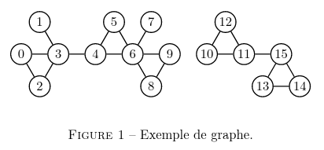
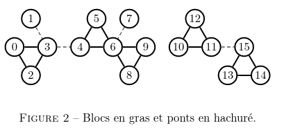
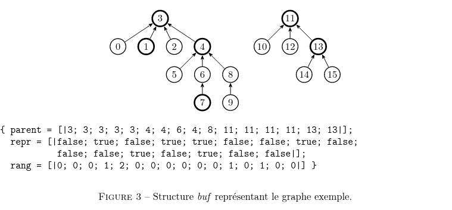
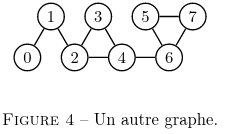
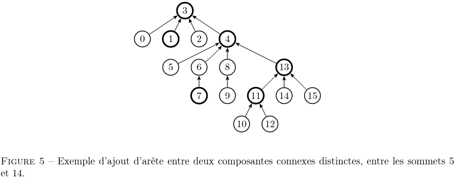
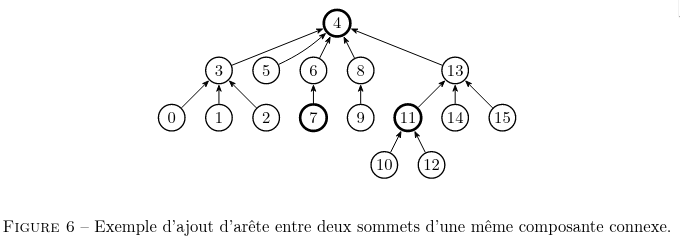

*Ceci est une copie partielle de l'épreuve 1 de la session 2023 de l'agrégation d'informatique. Je ne possède rien du texte qui va suivre.*

# Ponts et blocs dans un graphe non orienté





Dans un graphe non orienté, un pont est une arête dont la suppression fait croître le nombre de composantes connexes. Lorsque l’on retire tous les ponts d’un graphe, les composantes connexes restantes sont appelées blocs. Par exemple, le graphe représenté figure 1 possède 4 ponts, reliant les paires de sommets (1, 3), (3, 4), (6, 7) et (11, 15) et 6 blocs, comme illustré figure 2.

Dans ce problème, nous allons nous intéresser à un algorithme permettant de déterminer les blocs d’un graphe non orienté décrit en ligne, c’est-à-dire en ajoutant les arêtes une par une. On suppose que l’on connaît à l’avance le nombre n de sommets du graphe, et que ceux-ci sont numérotés de 0 à n − 1.

La programmation s’effectuera en OCaml. Le candidat peut, s’il en éprouve le besoin, définir des fonctions auxiliaires pour mieux structurer son code. Il devra alors en préciser le rôle.

## Représentation sous forme de forêt

Nous allons représenter le graphe sous forme d’une forêt à l’aide d’une structure de type _union-find_ et que nous appellerons _buf_ (pour _block union-find_). Cette structure consiste en trois tableaux de taille le nombre n de sommets du graphe :

```type buf = { parent : int array; repr : bool array; rang : int array; }```

Chaque bloc a un unique représentant (défini de façon arbitraire), indiqué par le tableau repr. Chaque sommet a un parent, représenté par le tableau du même nom et qui a deux fonctions :

- si un sommet _s_ est le représentant d’un bloc, notons-le _b_, alors soit `parent.(s) = s`, auquel cas _s_ est racine d’un des arbres de la forêt, soit il indique un sommet d’un bloc _b′_ tel qu’il existe un pont entre un sommet de b et un sommet de _b′_ ;
- sinon, en suivant les parents successifs à partir d’un sommet _s_, on arrive au représentant de son bloc.

Enfin, le tableau rang indique, pour chaque représentant de bloc, une mesure de la taille de ce bloc. Cette valeur interviendra uniquement à la question 2.10 lors de l’implémentation de l’opération de fusion entre blocs.

Ainsi, tous les blocs sont représentés à la manière d’une structure de type _union-find_, à la différence que les différents blocs forment une forêt. On donne en figure 3 une représentation du graphe exemple de la figure 1 comme un élément de type _buf_, ainsi que son illustration graphique.





**Question 2.1.** Indiquer les blocs et les ponts du graphe représenté figure 4.

**Question 2.2.** Représenter graphiquement une structure _buf_ correspondant au graphe de la figure 4.

**Question 2.3.** Écrire une fonction `init : int -> buf` qui, étant donné un entier n, renvoie une structure buf décrivant un graphe de n sommets sans aucune arête : chaque sommet donne lieu à un bloc de rang 0 dont il est le représentant.

**Question 2.4.** Écrire une fonction `find : buf -> int -> int` qui renvoie le représentant dans la structure _buf_ du sommet passé en argument. On mettra en œuvre la _compression de chemin_ : on modifie les parents de tous les sommets croisés sur le chemin entre le sommet de départ et son représentant, chaque sommet ayant pour nouveau parent leur représentant commun.

**Question 2.5.** Écrire une fonction `blocs : buf -> int list list` qui renvoie la liste des blocs correspondant à la structure passée en argument. L’ordre des blocs ainsi que l’ordre des sommets à l’intérieur d’un bloc n’est pas contraint. Ainsi, avec le graphe de la figure 1 (représenté par la forêt de la figure 3), on peut avoir :

```[[15; 13; 14]; [12; 11; 10]; [7]; [9; 8; 6; 5; 4]; [3; 2; 0]; [1]]```

On utilisera systématiquement la fonction `find` pour déterminer le représentant d’un sommet.

## Ajout d'arêtes

Nous allons maintenant étudier l’effet de l’ajout d’une arête sur notre structure. Plusieurs cas sont possibles, suivant que les extrémités de l’arête ajoutée appartiennent à un même bloc, à des blocs distincts d’une même composante connexe, ou à des blocs de composantes connexes distinctes. Notons que si l’on ajoute une arête entre les sommets d’un même bloc, aucune modification n’est nécessaire. Pour traiter les deux autres cas, nous allons tout d’abord écrire quelques fonctions utilitaires avant d’implémenter la fonction d’ajout d’arête proprement dite.

Dans la suite, on appelle chaîne de représentants une suite finie non vide _(s<sub>0</sub>, ..., s<sub>p</sub>)_ de représentants telle que pour tout _i ∈ {0, ..., p − 1}_, le sommet si est le représentant du parent de _s<sub>i+1</sub>_. En particulier, les représentants apparaissent de la gauche vers la droite par profondeur croissante. De façon naturelle, une telle chaîne sera représentée par une liste.

**Question 2.6.** Écrire une fonction `chaine_racine : buf -> int -> int list` qui, étant donné un sommet s du graphe, renvoie la chaîne des représentants reliant le représentant de s à la racine de l’arbre correspondant.

Ainsi, avec l’exemple précédent, la chaîne des représentants pour le sommet 5 est la liste [3; 4]. De même, pour le sommet 7 (qui est lui-même un représentant), on doit obtenir [3; 4; 7].

### Arêtes entre des sommets de composantes connexes distinctes

Lorsque l’on ajoute une arête entre deux sommets appartenant à des composantes connexes distinctes, cette nouvelle arête est un pont. En terme de structure _buf_, si l’on note _u_ et _v_ les extrémités de l’arête ajoutée, on considère la chaîne des représentants allant de celui de l’un des sommets (supposons que l’on utilise _u_) vers la racine correspondante et on « retourne » toutes les flèches de la chaîne, faisant du représentant de _u_ la nouvelle racine de son arbre. On change alors le parent du représentant de _u_ pour le faire pointer vers celui de _v_.

La figure 5 illustre le résultat de l’ajout d’une arête entre les sommets 5 et 14.



**Question 2.7.** Représenter la forêt obtenue après avoir ajouté dans la forêt représentée en figure 3 une arête entre les sommets 7 et 12. On supposera que c’est le chemin issu du sommet 7 qui est retourné.

**Question 2.8.** Écrire une fonction `retourner_chaine : buf -> int list -> unit` qui implémente le retournement de chaîne présenté ci-dessus, sans effectuer le changement de parent de la nouvelle racine. On supposera que la liste passée en argument est une chaîne de représentants, de premier élément la
racine d’un arbre

### Arêtes entre blocs distincts d'une même composante connexe

L’ajout d’une arête entre deux blocs d’une même composante connexe va entraîner la fusion de ces deux blocs ainsi que de tous les blocs compris entre les deux. Par exemple, comme illustré sur la figure 6, l’ajout d’une arête entre les sommets 1 et 15 à partir du graphe de la figure 5 conduit à la fusion des blocs de représentants 1, 3, 4 et 13.

**Question 2.9.** Représenter une forêt que l’on peut obtenir après avoir ajouté une arête entre les sommets 7 et 12 dans la forêt représentée en figure 5.

**Question 2.10.** Écrire une fonction `union : buf -> int -> int -> unit` qui effectue l’union des blocs dont les représentants sont passés en argument. Concrètement, le parent du représentant du bloc de plus petit rang deviendra le représentant du bloc de plus grand rang. En cas d’égalité des rangs, le choix se fera de façon arbitraire, et le rang du bloc résultant augmentera de 1. Le rang d’un sommet qui n’est pas un représentant ne joue aucun rôle. On ne se souciera pas, pour le moment, de la valeur du parent du bloc obtenu.



**Question 2.11.** Écrire une fonction `fusion_chaine : buf -> int list -> unit` qui effectue la fusion de tous les blocs dont les représentants sont dans la chaîne de représentants passée en argument. On portera une attention particulière, une fois la fusion de la chaîne effectuée, à la valeur du parent du représentant du bloc obtenu.

### Fonction d'ajout

**Question 2.12.** Écrire une fonction `ajout : buf -> int -> int -> unit` qui implémente l’ajout d’un arête entre les deux sommets _u_ et _v_ passés en argument. En notant leurs représentants _r<sub>u</sub>_ et _r<sub>v</sub>_ , si ceux-ci sont différents, on distingue (à partir des chaînes de ces représentants vers leurs racines respectives) les cas où ceux-ci appartiennent à des composantes connexes distinctes ou à la même composante connexe. Dans le premier cas, on retourne la chaîne d’un des représentants jusqu’à la racine puis on lui attribue comme parent l’autre représentant. Dans le second, on fusionne les blocs des chaînes reliant _r<sub>u</sub>_ et _r<sub>v</sub>_ à leur plus proche ancêtre commun qui est l’élément commun le plus profond de leurs chaînes respectives vers leur racine.

## Liste des ponts

On désire modifier la structure _buf_ afin de pouvoir obtenir, en plus des blocs, la liste des ponts du graphe modélisé.

**Question 2.13.** Décrire une telle modification, en indiquant précisément les modifications à apporter à la structure buf et au code des diverses fonctions pour la manipuler, ainsi que l’implémentation d’une nouvelle fonction

```ponts : buf -> (int * int) list.```

Idéalement, les modifications des fonctions précédentes se traduiront par un surcoût de complexité constante et la fonction ponts sera de complexité linéaire en le nombre de sommets du graphe.

# Rappels sur le langage OCAML

Une liste est construite à partir de la liste vide [] et de la construction x :: _l_ qui renvoie une nouvelle liste dont la tête est l’élément x et dont la queue est la liste _l_. L’appel de List.rev _l_ renvoie une nouvelle liste, formée des éléments de la liste _l_ en ordre inverse.

On peut créer des tableaux avec les fonctions `Array.make`, `Array.init` et `Array.of_list`.
- L’appel de `Array.make n x` crée un tableau de taille n dont toutes les cases contiennent la valeur x.
- L’appel de `Array.init n f` crée un tableau de taille n dans lequel la valeur de la case d’indice i
est égale à _f(i)_.
- L’appel de `Array.of_list l` crée un tableau contenant, dans l’ordre, les éléments d’une liste _l_.

Les cases d’un tableau sont numérotées à partir de 0. La fonction Array.length renvoie la taille d’un tableau. Pour un tableau _t_, on accède à l’élément d’indice _i_ avec `t.(i)` et on le modifie avec `t.(i) <- v`.

On mentionne enfin le type polymorphe ’a option défini par :

```type ’a option = None | Some of ’a```

Un élément de la forme Some x correspond à la présence d’une valeur _x_ de type _’a_, et un élément de la forme None correspond à une absence de valeur
